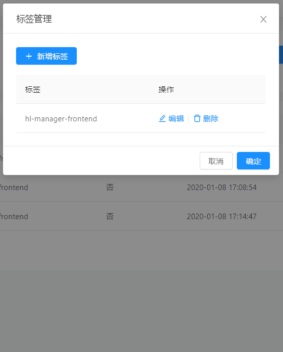

# 1.2.2 (2020-01-15)

### Features

- **readme:** 完善 readme，使用方式改变 app-tag-manager => ngx-tag-manager ([ea2a880](https://github.com/fengyinchao/ngx-tag-manager/commit/ea2a8809111218be006f5141422434badaf0cf80))
- **大更新:** 将导入组件方式改为导入模块，更具有通用性 ([1dc9721](https://github.com/fengyinchao/ngx-tag-manager/commit/1dc9721769796f3e115d56d1bfb1a7345e36b1b8))
- **弹窗文案控制:** 新增弹窗文案控制 ([a6188f8](https://github.com/fengyinchao/ngx-tag-manager/commit/a6188f8d6bf61840d0f1edde05a971213edfae21))

## ngx-tag-manager

Angular 中一种通用业务组件，标签管理器

使用场景：文章分类标签、公告类型标签等



### 基本使用

```
npm i ngx-tag-manager -D

// 注册组件
import { NgxTagManagerModule } from 'ngx-tag-manager';
@NgModule({
  imports:[
    ...,
    NgxTagManagerModule
  ]
})
// 使用组件

<button nz-button (click)="showTagManager=true" [nzType]="'primary'">
  <i nz-icon nzType="copy" nzTheme="outline"></i>
  <span>标签管理</span>
</button>

<ngx-tag-manager [show]="showTagManager" cate="ARTICLE" label="标签" [listApi]="api.getTagList"
  [saveApi]="api.saveTag" [deleteApi]="api.deleteTag" (closeEvent)="showTagManager=false"></ngx-tag-manager>
```

### API

- 输入属性

  show:boolean，控制标签弹窗的显示

  label: 弹窗文案控制，默认“标签”，如果用于岗位管理，则传入“岗位”,弹窗文案会变为岗位管理，新增岗位等等

  cate: 分类，标识哪一类标签，比如可以是文章的标签，也可以是岗位的标签

  listApi: 标签列表接口，GET/POST 参数 cate 标识分类

  saveApi: 新增或修改标签接口 POST 参数 id,name,cate

  deleteApi: 删除标签接口 POST 参数 id

- 输出属性

  closeEvent 关闭标签弹窗事件
